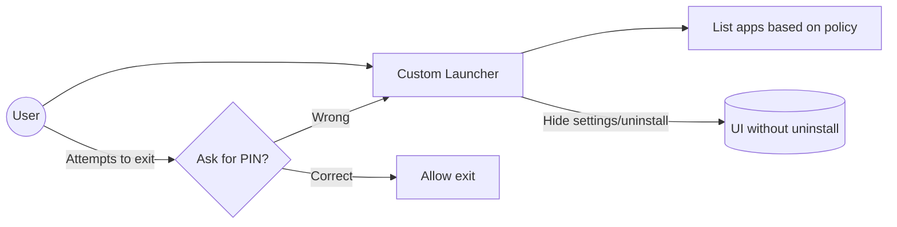

# Executive Summary

Preventing an Android app from being uninstalled **completely** on a standard device (non-rooted, non-enterprise) is not feasible – the user can always factory-reset or use ADB/bootloader to remove it.  In practice, **enterprise-grade** controls are required for “undeletable” apps.  The most robust approach is to run the device in Android Enterprise **Device Owner** (fully managed) mode or a **kiosk/lock-task** mode under a Mobile Device Management (MDM) solution.  In that scenario, the DevicePolicyManager APIs (for example, `setUninstallBlocked` or `setApplicationHidden`) can block or hide specific apps from the user【4†L25616-L25624】【18†L21723-L21731】.  Alternately, building a custom launcher as the default HOME can hide apps and uninstall options in the UI【25†L158-L166】.  However, **any** protection can ultimately be bypassed by advanced methods (ADB, safe mode, rooting, unlocked bootloader).  Enterprise approaches (Device Owner + FRP + hardware locks) can make bypass very difficult. 

Overall, the best practice is to use Android’s official device management features: provision the app as a **Device Owner** with the necessary policies (via NFC/QR provisioning or `adb shell dpm set-device-owner`【43†L278-L287】), then use the DevicePolicyManager to block uninstall, restrict settings, and lock the launcher.  If done properly (with persistent preferred home and safe-mode disabled), the user cannot change the launcher or uninstall protected apps through the normal UI.  We also discuss alternative options (system apps, SELinux, root) and their drawbacks. Finally, we cover legal and UX implications: forcing apps to stay on a *personal* phone may violate Google Play policies or user rights, so these measures are normally limited to corporate-owned or supervised devices. 

```mermaid
flowchart LR
  U((User)) -->|tries to uninstall app| DPM{Device Owner Active?}
  DPM -->|Yes| CheckDPM[Check DevicePolicyManager]
  DPM -->|No| OSUninstall[System proceeds to uninstall]
  CheckDPM -->|Blocked| Deny[Cancel uninstall (policy)]
  CheckDPM -->|Allowed| OSUninstall
  Deny --> U
  OSUninstall --> U
```
*Figure: On a managed device the DevicePolicyManager intercepts uninstall requests (and can block them)【4†L25616-L25624】.*

## Device Owner / Android Enterprise

**Overview:**  In Android Enterprise *fully-managed* (Device Owner) mode, a single Device Policy Controller (DPC) app has **device-owner** privileges and can enforce system-wide restrictions.  A DO app can call DevicePolicyManager APIs to block uninstall, hide apps, disable Settings/Play, etc.  These APIs are unavailable to normal apps.  For example, `DevicePolicyManager.setUninstallBlocked(admin, pkg, true)` prevents the user from uninstalling `pkg`【4†L25616-L25624】.  Similarly, `setApplicationHidden(admin, pkg, true)` makes an app invisible to the launcher【18†L21723-L21731】.  A DO can also disable the default package installer, settings UI, or even enforce a kiosk home screen. 

**Implementation:**  To use these APIs, your app must be provisioned as Device Owner.  This typically requires factory-resetting the device and provisioning via Android Enterprise enrollment (NFC/QR code) or using ADB for testing.  For example, after a wipe you can run:  
```bash
adb shell dpm set-device-owner "com.example.admin/.DeviceAdminReceiver"
```  
as shown in Android’s documentation【43†L278-L287】.  The app’s manifest must declare a `DeviceAdminReceiver` with `<uses-permission android:name="android.permission.MANAGE_DEVICE_POLICY_APPS_CONTROL"/>` (to call app-control APIs).  For instance:
```xml
<receiver android:name=".MyDeviceAdminReceiver"
    android:permission="android.permission.BIND_DEVICE_ADMIN">
  <meta-data android:name="android.app.device_admin"
             android:resource="@xml/device_admin_receiver"/>
  <intent-filter>
    <action android:name="android.app.action.DEVICE_ADMIN_ENABLED"/>
  </intent-filter>
</receiver>
<uses-permission android:name="android.permission.MANAGE_DEVICE_POLICY_APPS_CONTROL"/>
```
Once device owner, sample code to block uninstall might be:
```java
DevicePolicyManager dpm = context.getSystemService(DevicePolicyManager.class);
ComponentName admin = new ComponentName(context, MyDeviceAdminReceiver.class);
dpm.setUninstallBlocked(admin, "com.example.myapp", true);
dpm.setApplicationHidden(admin, "com.example.otherapp", true);
```
(The above requires API 21+, and the proper permission delegation【4†L25616-L25624】【18†L21723-L21731】.)

**Kiosk/Lock-Task Mode:**  The DO can also enter “lock task” (kiosk) mode to restrict the device to a specific app or set of apps.  In lock task mode, the user cannot leave the whitelisted apps and most system UI is disabled【34†L436-L444】.  For example, call `dpm.setLockTaskPackages(admin, new String[]{myKioskAppPackage});` then launch an activity with `options.setLockTaskEnabled(true)`【34†L478-L487】.  Alternatively, in the app manifest declare `<activity android:lockTaskMode="if_whitelisted">` on the kiosk activity【41†L603-L611】.  While locked, the status bar, Recents, and Home buttons can be suppressed or selectively enabled via `setLockTaskFeatures`【41†L714-L723】.  Lock task mode is very effective: as the doc explains, “When the system runs in lock task mode, device users typically can’t see notifications, access non-allowlisted apps, or return to the home screen”【34†L436-L444】.  

**Allowlisting and Launcher:**  A DO must explicitly allowlist the apps that can run in lock mode.  To keep a custom launcher running, register it as the persistent HOME handler: call `addPersistentPreferredActivity(admin, intentFilterForHome, launcherComponent)` to force it as default【23†L14722-L14730】.  The Ivanti MDM guide also notes a “Block uninstall” option when configuring apps, which under the hood uses these DPM methods【30†L75-L80】.  In short, under DO mode the device owner app can completely lock down which apps are visible and block all UI paths to uninstall them. 

**Limitations:**  These measures only work with device-owner privileges.  On a personal (unmanaged) device, you cannot silently activate a Device Admin to block uninstall – the user could always uninstall or revoke it.  Moreover, DO mode typically means corporate-owned devices; it’s not feasible for a generic consumer app.  Android’s security model allows the user to remove or factory reset to escape device owner status (unless hardware safeguards or FRP intervene).

## Kiosk / Lock Task Mode

**Overview:**  Kiosk mode is a special case of device-owner lockdown where the device is essentially dedicated to one or a few apps.  It is widely used in retail or corporate kiosks.  In this mode, only allowlisted apps (set by the DPC) can be launched, and the system UI (notifications, recents, status bar, global actions) is hidden【34†L436-L444】.  This ensures the user *cannot* access Settings, Play Store, or uninstall apps normally, because those apps are not allowlisted. 

**Implementation:**  From the DPC (device owner), call:
```java
String[] kiosk = { "com.example.app" };
dpm.setLockTaskPackages(admin, kiosk);
```
Then, start the kiosk app with:
```java
ActivityOptions opts = ActivityOptions.makeBasic();
opts.setLockTaskEnabled(true);
context.startActivity(launchIntent, opts.toBundle());
```
(As of Android 9+, a DPC can even start another app into lock mode; on earlier versions the app must call `startLockTask()` itself.)  In the app’s manifest, you can set `android:lockTaskMode="if_whitelisted"` on the main activity【41†L603-L611】 to have it auto-lock.  

**Effects:**  In lock-task mode, the system enforces a very strict environment.  The user cannot press Home or Back to exit (unless you enable those buttons via `setLockTaskFeatures`【41†L714-L723】).  Importantly, the uninstallation and Settings UIs are never reachable.  For example, even if the app drawer or recents were somehow shown, tapping an icon outside the allowlist does nothing.  This approach is by far the most secure against normal users, but it requires full device-owner control and is only practical for corporate (dedicated) devices.

## System App / Privileged App

**Overview:**  An app installed in the system partition (/system/app) cannot be uninstalled by a normal user or in Settings; at most it can be **disabled**.  This is how OEMs “bake in” mandatory apps.  In a non-rooted phone, user-installed apps are always removable【9†L184-L193】, so the **only** truly non-removable apps are system apps【9†L184-L193】.  

**Implementation:**  You would need to root the device or build a custom ROM image to place your APK in `/system`.  Once in `/system`, the app survives factory reset and isn’t listed in the normal uninstall UI.  However, note two things: (1) This requires control over the device firmware (not possible on a stock consumer device without rooting), and (2) a user with root (or with an unlocked bootloader and custom recovery) *can* still remove the APK file and delete it.  As one developer notes: *“If you want to make your app a system app, you need to root your phone to add it to the system apps folder – which ultimately means that it can later be removed by the user of the rooted phone…”*【9†L184-L193】. 

**Trade-offs:**  System-app installation is very rigid and not user-transparent.  It breaks normal Android update channels and requires OS-level control.  It’s generally used only for OEM software, not by third-party developers.  This approach can prevent “casual” uninstall, but anyone with technical skill can bypass it by reflashing or via root.  It’s also a poor user experience on a personal device (the user might see an app they can’t remove).

## Root/SELinux and Hardware

**Root Access:**  If the user gains root, all bets are off.  Rooted users (or malicious apps exploiting a root vulnerability) can uninstall or disable any app, change policies, or remove device admin protection.  In fact, obtaining root is one of the main bypass methods (see below).  Therefore, any solution that relies on software protections must assume the device is not rooted and bootloader is locked.  

**SELinux:**  Android’s SELinux enforces intra-device security, but it does not directly prevent uninstallation.  SELinux blocks unauthorized file operations unless the process has the right domain.  Even if an app is hidden or blocked by policy, SELinux is not involved.  Root access (or a vendor unlock) is a higher-level concern; SELinux mainly stops privileged actions by normal apps, but won’t stop the owner if they have root.

**Hardware Protections:**  Some devices (e.g. Samsung Knox) offer hardware-backed enforcement like disabling USB or locking the bootloader so that factory reset requires credentials.  Android’s Factory Reset Protection (FRP) ties a reset to the user’s Google account.  A device owner app can also call `setFactoryResetProtectionPolicy()` to configure FRP behavior.  However, against a determined user, even FRP can sometimes be circumvented (or simply wiped if no lock is in place).  In summary, only physical security (like preventing opening the back cover, disabling hardware keys, or using enterprise-grade FRP) can make uninstallation truly impossible – and that goes beyond standard Android APIs.

## Bypass Methods (User Workarounds)

Even a locked-down device can be bypassed by advanced means.  Key bypasses include:

- **ADB/Developer Options:**  If the user can enable USB debugging or the device is already authorized for ADB, they can run commands like `adb uninstall` or `adb shell pm uninstall --user 0 com.example.app` to remove apps directly【4†L25616-L25624】.  A device owner *can* disable Developer Mode via policy, but if it’s already on then ADB is a powerful backdoor.  

- **Safe Mode:**  Booting into Android’s Safe Mode disables all non-system apps.  If your custom launcher or DPC is a user-installed app, safe mode may revert to the default system launcher and allow uninstallation of your app.  (Some MDM solutions allow *disabling* safe mode via vendor APIs, as Hexnode documents【33†L39-L47】, but this only works on certain devices or DO mode.)  

- **Recovery/Bootloader:**  If the bootloader is unlocked, the user can boot into recovery and factory-reset or sideload an unsigned image, wiping all policies.  Even with FRP, a cold reboot can allow flashing a new boot image or rom (unless the bootloader is locked with a password).  

- **Factory Reset:**  On a fully managed device, a factory reset typically removes the Device Owner status (the device returns to a fresh state).  Some devices support “Reset Protection” (requiring an admin PIN to factory reset), but this varies by OEM.  In general, a factory reset is a guaranteed bypass unless the device is somehow hardware-locked (e.g. a kiosk without power-off).  

- **Rooting:**  Exploiting a kernel or system vulnerability to gain root access will circumvent any software lockdown.  Once rooted, a user (or malicious app) can remove device admin privileges, delete APKs from /data or /system, and disable SELinux policies.  

In short: *no solution is 100% bulletproof if the user is resourceful*.  Device Owner mode raises the bar, but physical or privilege escalations remain critical risk factors.  

## Custom Launcher Approach

Another strategy is to **replace the home screen** with a custom launcher that only shows allowed apps and removes uninstall controls. This is commonly used for parental-control or corporate kiosk UIs.  

- **Launcher as Default HOME:**  Declare an activity with intent filters for HOME:
  ```xml
  <activity android:name=".MyLauncherActivity">
    <intent-filter>
      <action android:name="android.intent.action.MAIN"/>
      <category android:name="android.intent.category.HOME"/>
      <category android:name="android.intent.category.DEFAULT"/>
    </intent-filter>
  </activity>
  ```
  When the user presses the Home button, this activity launches. If you set this launcher as the *persistent preferred* via `addPersistentPreferredActivity` (DevicePolicyManager) and have locked-down the Settings UI, the user cannot switch to another launcher【23†L14722-L14730】.  In practice, on a non-managed device Android may still show a “Complete action using” dialog unless you use DO APIs to enforce it.

- **Filtering Visible Apps:**  The launcher can query the PackageManager for installed apps and selectively display them.  For example, maintain a list of allowed package names based on user selection.  The UI simply doesn’t show icons for blocked apps.  (Under device-owner mode you could also call `setApplicationHidden` to *hide* them at the OS level【18†L21723-L21731】, but if you’re just writing a custom launcher you can also just omit them from the grid.)  

- **Disabling Uninstall UI:**  A custom launcher can disable the usual long-press uninstall flow in its UI by not implementing it.  If the standard Settings or Play Store is hidden (e.g. disabled by DPC or removed from the launcher), the user has no built-in way to uninstall.  On a managed device, you would also call `setUninstallBlocked` on critical packages【4†L25616-L25624】.  

- **Exit Protection:**  To resist changing the launcher or exiting it, the app can require a password or PIN.  For example, intercept the Back button to show a PIN dialog.  (Some solutions use the `android:testOnly="true"` manifest attribute trick so that the launcher can catch the BACK key).  A well-known suggestion is: *“Set a password for exiting your custom launcher. If kids want to exit your launcher, they should enter a password.”*【25†L158-L166】.  This is not an Android-provided feature, but can be implemented in your app logic.

- **Resisting Launcher Change:**  On a standard device the user could install another launcher and set it via Settings.  On a managed device, the DO can block changing the HOME intent as mentioned above.  Also, disabling the Play Store and forbidding installation of other launchers is essential.  

**Example Flowchart: Custom Launcher**  

*Figure: A custom HOME launcher shows only allowed apps and can block exits (e.g. with a PIN).  Under device-owner mode, it would be made the permanent default home (via `addPersistentPreferredActivity`【23†L14722-L14730】) and the standard launcher/settings removed.*

**Limitations:**  A custom launcher approach *by itself* (without DO) is relatively weak: if the user reboots into safe mode or goes to Settings by voice or finds some other path, they could restore the default launcher and uninstall.  It relies on hiding rather than true policy.  Therefore, to be robust it is usually combined with device-owner APIs.  For example, in a kiosk scenario you’d both install the custom launcher as system or DO and disable the real Settings/Play.  

## Comparison of Approaches

| **Approach**                  | **Security Level**        | **User Bypass Risk**          | **Required Privileges**                     | **Implementation Complexity** | **Use Case**                      |
|-------------------------------|---------------------------|-------------------------------|----------------------------------------------|-------------------------------|------------------------------------|
| **None (standard)**           | Low                       | Very High (user can uninstall via Settings, ADB, etc.) | None                                         | Simple (just normal app)      | **Consumer devices (no lock).**    |
| **Work Profile (Profile Owner)** | Medium (locks only Work side) | High for personal side (user can switch to personal profile to uninstall) | Profile Admin (Android Enterprise)          | Moderate (set up work profile) | **BYOD or managed profile.**       |
| **Device Owner (Android Enterprise)** | High                      | Low (only factory reset or hardware attack) | Device Admin (full device owner)            | High (provisioning, policies) | **Corporate-owned devices.**       |
| **Kiosk/Lock-Task Mode**      | Very High (extreme lockdown) | Moderate (power cycle might exit, or dev disallows) | Device Owner (allowlist + manifest)        | High (needs DO + setup)       | **Dedicated kiosks/tablets.**      |
| **Custom Launcher (non-DO)**  | Low (UI only)             | High (safe mode or ADB breaks)  | None (unless combined with DO)              | Low (write app)              | **Parental controls, demo apps.**   |
| **System App (OEM)**          | Medium (users can’t remove normally) | Moderate (root or reflashing removes it) | System privilege (root/ROM)             | Very High (custom OS build)   | **OEM utilities, pre-installed.**   |
| **MDM/EMM (DO-based)**        | High                      | Low (only admin actions or reset) | Depends (DO + vendor console config)      | High (enrollment, console config) | **Enterprise management (Airwatch/Intune/etc.)** |

This table summarizes each method’s trade-offs.  Enterprise/Device-Owner solutions rank highest for security but need heavy setup, whereas simple launchers or user apps are weak security-wise. 

## Legal, UX, and Security Implications

- **User Consent & Policy:** For personal phones, Google Play disallows apps that unduly circumvent system controls.  In Google’s policies, apps must not interfere with or disable core device functionality (like uninstalling) without user consent.  A consumer would likely reject an app they cannot remove.  In contrast, enterprise-owned devices allow management software to enforce these restrictions as part of corporate policy.  Always ensure compliance with the [Android Enterprise requirements](https://developers.google.com/android/management) and with local laws (some regions have device possession laws).  

- **Privacy & Control:** Locking down a user’s device can raise privacy concerns.  E.g. disabling ADB and factory reset can look like spyware behavior.  Best practice is to clearly inform device users (employees) that their device is managed.  Use MDM enrollment terms or EULA to explain restrictions.  

- **Security:** While blocking uninstall can help protect corporate apps (like VPN or anti-malware) from tampering, it’s only one layer.  Users might try to find workarounds.  Pair app lockdown with strong screen locks, encrypted storage, and remote-wipe capabilities.  On high-security devices, physically securing the bootloader (as with Samsung Knox or using Android’s Verified Boot) and enabling Factory Reset Protection (FRP) will mitigate brute-force resets.  However, be aware: forcing apps to stay installed means that if the device *is lost or stolen*, sensitive managed apps remain.  Always consider remote deactivation.  

- **User Experience:** A very locked device can frustrate users.  Hiding core functionality may break user expectations (e.g. no easy way to reset Wi-Fi if Settings is hidden).  Aim for minimal necessary restrictions.  For example, instead of fully disabling Settings, some solutions use “Settings lockdown” modes that only allow certain pages.  Good UX also means providing a clear “exit path” for legitimate cases (perhaps via remote admin uninstall or factory reset with authorization).  

## Best Practices and Mitigations

1. **Use Android Enterprise:** Wherever possible, implement lockdown using Android’s official Enterprise APIs.  Provision the app as Device Owner and use `setUninstallBlocked` and related policies to manage apps.  This is the only Google-sanctioned way to achieve uninstall-blocking in a compliant manner【4†L25616-L25624】.  

2. **Disable Alternatives:**  Disable or hide any alternate uninstall paths.  Under DO mode, turn off USB debugging (`setUsbDataSignalingEnabled(false)`), disable unknown sources (so no sideloading), and block Safe Mode (via MDM if available【33†L39-L47】).  Many MDMs allow disabling ADB and Safe Mode on Device Owner devices.  

3. **Lock Default Launcher:**  Make your app (or designated launcher) the persistent HOME.  Call `addPersistentPreferredActivity` to eliminate the “Complete action using” prompt【23†L14722-L14730】.  Ensure system launchers are disabled or hidden in policy so that even in Safe Mode the device can’t easily switch.  

4. **Silent App Installation:**  For enterprise-managed devices, use silent push-install (EMM app distribution) so the app is installed as a system-level operation.  This prevents “Install” prompts and can mark the app as non-user-removable.  EMM consoles often have a “Block uninstall” switch in their app catalogs (see Ivanti example【30†L75-L80】).  

5. **User Training:**  Educate users that the device is managed.  Accidental or intentional resets will be prevented or reported.  For example, some EMM setups can notify IT if a user tries to remove the management profile.  This ensures that if a user needs to undo changes, they must go through the proper channel.  

6. **Regular Updates:**  Keep the device OS and security patches up to date.  Often vulnerabilities (root exploits) are patched in updates.  On truly critical devices, use manufacturer tools (e.g. Knox) to lock down the firmware.  

7. **Plan for Bypass:**  Accept that determined users may still find creative ways.  The goal is to make casual uninstallation very difficult.  Use **defense-in-depth**: for example, even if someone boots to recovery, require a password (FRP) or have the device auto-wipe if tampering is detected.  Consider integrating a watchdog: if your app disappears unexpectedly, a companion service could alert an administrator.  

In conclusion, **completely blocking all uninstall methods on Android is only realistic in an enterprise-managed, device-owner context using official APIs**.  On ordinary devices the best you can do is discourage uninstallation (e.g. requiring a password to exit your launcher), but savvy users can bypass software controls.  The recommended approach is to combine Android Enterprise device-owner provisioning, kiosk mode (if applicable), and a locked-down launcher.  This multilayer strategy – backed by corporate policy – gives a practical and user-acceptable solution to keep apps on the device while balancing legal and usability considerations.

**Sources:** Android official documentation on [DevicePolicyManager](https://developer.android.com/reference/android/app/admin/DevicePolicyManager)【4†L25616-L25624】【18†L21723-L21731】【23†L14722-L14730】【34†L436-L444】【41†L603-L611】; StackOverflow and technical articles【9†L184-L193】【25†L158-L166】【27†L91-L99】【30†L75-L80】【13†L1-L4】; Android Open Source Project guides【43†L278-L287】; Hexnode/MDM guidance【33†L39-L47】. (All code examples and policies reflect Android 12+ APIs.)